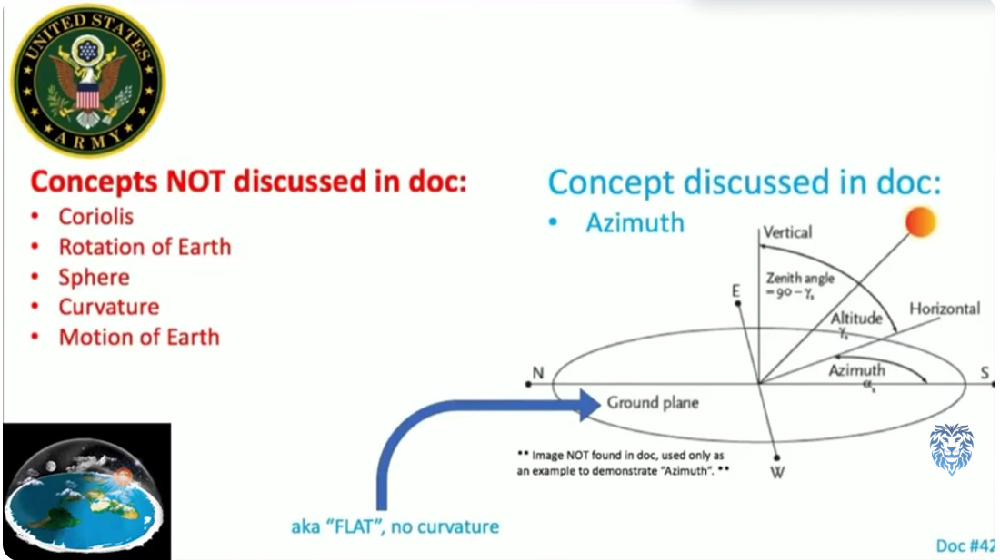
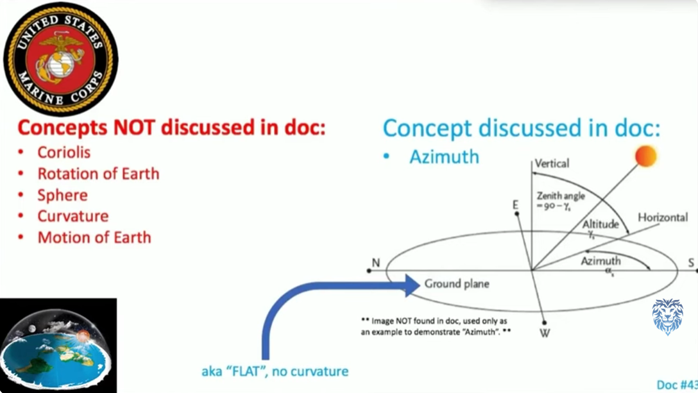
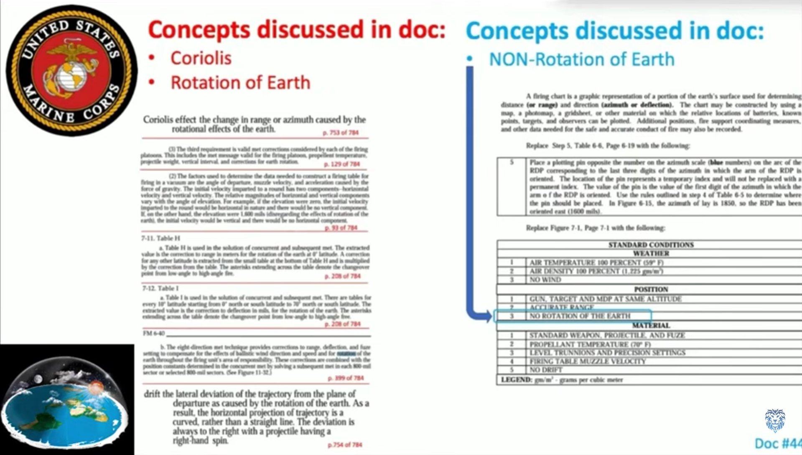
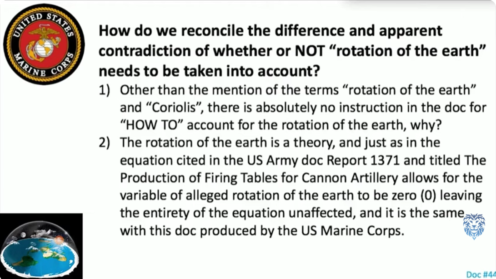

# 44 Government Documents Admitting FLAT EARTH 

Taken from this video: https://www.youtube.com/watch?v=HwhecZcqpkA 

Main doc and PDF collection here:
https://github.com/LeoBlanchette/articles/tree/main/44_government_flat_earth_documents 

Format: 

- Doc #
- Title 
- Page(s) (of Government Admits Flat Earth)
- Author
- Doc name
- Links
- The PDF file in this repo

## See also: 
### Great Creation Debate 
https://www.youtube.com/watch?v=9e53mxNAPBA

# Doc #1
## Dissertations Defended in the Scientific Council of the Institute of Physics of the Earth
Page: 19 & 20

**Kirillov, F.A.**

**CIA-RDP86-00513R001343720008-3.pdf**

https://www.cia.gov/library/readingroom/docs/CIA-RDP86-00513R001343720008-3.pdf

https://web.archive.org/web/20200317063944/https://www.cia.gov/library/readingroom/docs/CIA-RDP86-00513R001343720008-3.pdf 

[CIA-RDP86-00513R001343720008-3.pdff](PDF/CIA-RDP86-00513R001343720008-3.pdf)

--- 

# Doc #2
## Propagation of Electromagnetic Fields Over Flat Earth
Page: 7, 17, 18, 28, 35 

**Joseph R. Miletta**

**ARL-TR-2352.pdf**

https://www.arl.army.mil/arlreports/2001/ARL-TR-2352.pdf

[PDF/ADA389123.pdf](PDF/ADA389123.pdf)

---

# Doc #3
## An Energy Budget Model to Calculate the Low Atmosphere Profiles of Effective Sound Speed at Night
Page: 10, 16

**Arnold Tunick**

**ARL-MR-563.pdf**

https://www.arl.army.mil/arlreports/2003/ARL-MR-563.pdf

https://web.archive.org/web/20041023101620/https://www.arl.army.mil/arlreports/2003/ARL-MR-563.pdf 

[PDF/ARL-MR-563.pdf](PDF/ARL-MR-563.pdf)

---

# Doc #4
## Computationally Efficient Algorithms for Estimating the Angle of Arrival of Helicopters Using Acoustic Arrays
Page: 17, 30, 31, 35

**Geoffrey Goldman**

**ARL-TR-4998.pdf**

https://www.arl.army.mil/arlreports/2009/ARL-TR-4998.pdf

[PDF/ADA507627.pdf](PDF/ADA507627.pdf)

---

# Doc #5
## Adding Liquid Payloads Effects to the 6-DOF Trajectory of Spinning Projectiles
Page: 7

**Gene R. Cooper**

**ARL-TR-5118.pdf**

https://www.arl.army.mil/arlreports/2010/ARL-TR-5118.pdf

[PDF/ADA519118.pdf](PDF/ADA519118.pdf)

---

# Doc #6
## Trajectory Prediction of Spin-Stabilized Projectiles With a Steady Liquid Payload
Page: 10, 

**Gene R. Cooper**

**ARL-TR-5810.pdf**

https://www.arl.army.mil/arlreports/2011/ARL-TR-5810.pdf

[PDF/ADA553573.pdf](PDF/ADA553573.pdf)

---

# Doc #7
## Derivation and Definition of a Linear Aircraft Model
Page: 6, 35, 55, 102

**Eugene L. Duke, Robert F. Antoniewicz, and Keith D. Krambeer**

**NASA Reference Publication 1207**

https://www.nasa.gov/centers/dryden/pdf/88104main_H-1391.pdf

https://web.archive.org/web/20100318025201/https://www.nasa.gov/centers/dryden/pdf/88104main_H-1391.pdf 

[PDF/88104main_H-1391.pdf](PDF/88104main_H-1391.pdf)

--- 

# Doc #8
## General Equations of Motion for a Damaged Asymmetric Aircraft
Page: 2, 

**Barton J. Bacon and Irene M. Gregory**

**NASA Langley Research Center, Hampton, VA, 23681**

https://ntrs.nasa.gov/archive/nasa/casi.ntrs.nasa.gov/20070030307.pdf

[PDF/20070030307.pdf](PDF/20070030307.pdf)

--- 

# Doc #9
## Predicted Performance of a Thrust-Enhanced SR-71 Aircraft with an External Payload
Page: 10, 

**Timothy R. Conners**

**NASA Technical Memorandum 104330**

https://www.nasa.gov/centers/dryden/pdf/88507main_H-2179.pdf

https://web.archive.org/web/20090426194240/https://www.nasa.gov/centers/dryden/pdf/88507main_H-2179.pdf

[PDF/88507main_H-2179.pdf](PDF/88507main_H-2179.pdf)

---

# Doc #10
## Derivation of a Point-Mass Aircraft Model used for Fast-Time Simulation
Page: 7, 

**Dr. Lesley A. Weitz**

**MITRE Technical Report**

https://www.mitre.org/sites/default/files/publications/pr_15-1318-derivation-of-point-mass-aircraft-model-used-for-fast-time-simulation.pdf

[PDF/pr_15-1318-derivation-of-point-mass-aircraft-model-used-for-fast-time-simulation.pdf](PDF/pr_15-1318-derivation-of-point-mass-aircraft-model-used-for-fast-time-simulation.pdf)

--- 

# Doc #11
## A Method for Reducing The Sensitivity of Optimal Nonlinear Systems to Parameter Uncertainty
Page: 14

**Jarrell R. Elliott (Langley Research Center) and William F. Teague (University of Kansas)**

**NASA Technical Note NASA TN D-6218**

https://ntrs.nasa.gov/archive/nasa/casi.ntrs.nasa.gov/19710018599.pdf

[PDF/19710018599.pdf](PDF/19710018599.pdf)

---

# Doc #12
## Calculation of Wind Compensation for Launching of Unguided Rockets
Page: 8, 10
**Robert L. James, Jr., and Ronald J. Harris**

**NASA TN D-645**

https://ntrs.nasa.gov/archive/nasa/casi.ntrs.nasa.gov/20040008097.pdf

[PDF/20040008097.pdf](PDF/20040008097.pdf)

---

# Doc #13
## User's Manual for LINEAR, a FORTRAN Program to Derive Linear Aircraft Models
Page: 16

**Eugene L. Duke, Brian P. Patterson, and Robert F. Antoniewicz**

**NASA Technical Paper 2768**

https://www.nasa.gov/centers/dryden/pdf/88072main_H-1259.pdf

https://web.archive.org/web/20100218161355/https://www.nasa.gov/centers/dryden/pdf/88072main_H-1259.pdf

[PDF/88072main_H-1259.pdf](PDF/88072main_H-1259.pdf)

---

# Doc #13
## User's Manual for LINEAR, a FORTRAN Program to Derive Linear Aircraft Models
Page: 16

**Eugene L. Duke, Brian P. Patterson, and Robert F. Antoniewicz**

**NASA Technical Paper 2768**

https://www.nasa.gov/centers/dryden/pdf/88072main_H-1259.pdf

https://web.archive.org/web/20090426210547/https://www.nasa.gov/centers/dryden/pdf/88072main_H-1259.pdf

[PDF/88072main_H-1259.pdf](PDF/88072main_H-1259.pdf)

---

# Doc #14
## User's Manual for Interactive LINEAR, a FORTRAN Program to Derive Linear Aircraft Models
Page: 4, 126

**Robert F. Antoniewicz, Eugene L. Duke, and Brian P. Patterson**

**NASA Technical Paper 2835**

https://ntrs.nasa.gov/archive/nasa/casi.ntrs.nasa.gov/19890007066.pdf

[PDF/19890007066.pdf](PDF/19890007066.pdf)

---

# Doc #15
## Determination of Angles of Attack and Sideslip from Radar Data and a Roll-Stabilized Platform
Page: 2, 

**John S. Preisser**

**NASA TM X-2514**

https://ntrs.nasa.gov/archive/nasa/casi.ntrs.nasa.gov/19720012071.pdf

[PDF/19720012071.pdf](PDF/19720012071.pdf)

--- 

# Doc #16
## U.S. Standard Atmosphere (1962)
Page: 22

**Not specified** **U. S. Standard Atmosphere, 1962**

https://ntrs.nasa.gov/archive/nasa/casi.ntrs.nasa.gov/19630003300.pdf

[PDF/19630003300.pdf](PDF/19630003300.pdf)

---

# Doc #17
## An Aircraft Model for the AIAA Controls Design Challenge
Page: 13

**Randal W. Brumbaugh**

**Contract NAS 2-12722**

https://www.nasa.gov/centers/dryden/pdf/88248main_H-1777.pdf

https://web.archive.org/web/20100218164852/https://www.nasa.gov/centers/dryden/pdf/88248main_H-1777.pdf

[PDF/88248main_H-1777.pdf](PDF/88248main_H-1777.pdf)

---

# Doc #18
## Investigation of Aircraft Landing in Variable Wind Fields
Page: 14

**Walter Frost and Kapuluru Ravikumar Reddy**

**NASA Contractor Report 3073**

https://ntrs.nasa.gov/archive/nasa/casi.ntrs.nasa.gov/19790005472.pdf

[PDF/19790005472.pdf](PDF/19790005472.pdf)

---

# Doc #19
## A Mathematical Model of the CH-53 Helicopter
Page: 25 

**William R. Sturgeon, James D. Phillips, Ames Research Center, Moffett Field, California**

**NASA Technical Memorandum 81238**

https://ntrs.nasa.gov/archive/nasa/casi.ntrs.nasa.gov/19810003557.pdf

https://web.archive.org/web/20160705192311/https://ntrs.nasa.gov/archive/nasa/casi.ntrs.nasa.gov/19810003557.pdf

[PDF/19810003557.pdf](PDF/19810003557.pdf)

---

# Doc #20
## Development and Validation of a Piloted Simulation of a Helicopter and External Sling Load
Page: 6, 37, 48

**J. D. Shaughnessy, Thomas N. Deaux, and Kenneth R. Yenni**

**NASA Technical Paper 1285**

https://ntrs.nasa.gov/archive/nasa/casi.ntrs.nasa.gov/19790005912.pdf

[PDF/19790005912.pdf](PDF/19790005912.pdf)

---

# Doc #21
## Atmospheric Oscillations
Page: 13

**A. J. Lineberger and H. D. Edwards**

**Georgia Tech Project A-652-001**

https://ntrs.nasa.gov/archive/nasa/casi.ntrs.nasa.gov/19650015408.pdf

[PDF/19650015408.pdf](PDF/19650015408.pdf)

---

# Doc #22
## Stability and Control Estimation Flight Test Results for the SR-71 Aircraft With Externally Mounted Experiments
Page: 18,19

**Timothy R. Moes and Kenneth Iliff**

**NASA TP-2002-210718**

https://www.nasa.gov/centers/dryden/pdf/88733main_H-2465.pdf

https://web.archive.org/web/20100218161000/https://www.nasa.gov/centers/dryden/pdf/88733main_H-2465.pdf

[PDF/88733main_H-2465.pdf](PDF/88733main_H-2465.pdf)

--- 

# Doc #23
## Flight Testing a V/STOL Aircraft to Identify a Full-Envelope Aerodynamic Model
Page: 9

**B. David McNally and Ralph E. Bach, Jr.**

**NASA**

https://ntrs.nasa.gov/archive/nasa/casi.ntrs.nasa.gov/19880014378.pdf

[PDF/19880014378.pdf](PDF/19880014378.pdf)

---

# Doc #24
## Singular Arc Time-Optimal Climb Trajectory of Aircraft in a Two-Dimensional Wind Field
Page: 2, 6

**Nhan Nguyen**

**NASA Ames Research Center, Moffett Field, CA 94035**

https://ntrs.nasa.gov/archive/nasa/casi.ntrs.nasa.gov/20060053337.pdf

[PDF/20060053337.pdfxt](PDF/20060053337.pdf)

---

# Doc #25
## STUDIES ON INSTABILITIES IN LONG-BASELINE TWO-WAY SATELLITE TIME AND FREQUENCY TRANSFER (TWSTFT) INCLUDING A TROPOSPHERE DELAY MODEL
Page: 2

**D. Piester, A. Bauch, M. Fujieda, T. Gotoh, M. Aida, H. Maeno, M. Hosokawa, S. H. Yang**

**39th Annual Precise Time and Time Interval (PTTI) Meeting**

https://tycho.usno.navy.mil/ptti/2007papers/paper21.pdf

https://web.archive.org/web/20161019083543/https://tycho.usno.navy.mil/ptti/2007papers/paper21.pdf 

[PDF/paper21.pdf](PDF/paper21.pdf)

---

# Doc #26
## Scale-Insensitive Detection Algorithm for FLIR Imagery
Page: 6

**Sandor Der, Chris Dwan, Alex Chan, Heesung Kwon, and Nasser Nasrabadi**

**ARL-TN-175**

https://www.arl.army.mil/arlreports/2001/ARL-TN-175.pdf

https://web.archive.org/web/20161225070359/https://www.arl.army.mil/arlreports/2001/ARL-TN-175.pdf

[PDF/ARL-TN-175.pdf](PDF/ARL-TN-175.pdf)

---

# Doc #27
## User Manual for the Microsoft Window Edition of the Scanning Fast-Field Program (WSCAFFIP) Version 3.0
Page: 45

**John M. Noble**

**ARL-TR-2696**

https://www.arl.army.mil/arlreports/2003/ARL-TR-2696.pdf

[PDF/ARL-TR-2696.pdf](PDF/ARL-TR-2696.pdf)

---

# Doc #28
## Path-Loss Measurements in a Forested Environment at VHF
Page: 8, 16, 17, 18, 19, 20, 23, 25, 26, 35, 

**Robert J. Tan and Suzanne R. Stratton**

**ARL-TR-2156**

http://www.arl.army.mil/arlreports/2000/ARL-TR-2156.pdf

[PDF/ADA383456.pdf](PDF/ADA383456.pdf)

---

# Doc #29
## Review of Sound Propagation in the Lower Atmosphere
Page: 18, 208

**Wesley L. Nyborg, David Minizer**

**Aero Medical Laboratory, Contract No. AF 33(616)-360, Project No. 7212**

https://apps.dtic.mil/dtic/tr/fulltext/u2/067880.pdf

https://web.archive.org/web/20190502031143/https://apps.dtic.mil/dtic/tr/fulltext/u2/067880.pdf

[PDF/067880.pdf](PDF/067880.pdf)

---

# Doc #30
## Beacon Position and Attitude Navigation Aided by a Magnetometer
Page: 11

**Xu Ma and Gonzalo R. Arce**

**ARL-CR-650**

https://www.arl.army.mil/arlreports/2010/ARL-CR-650.pdf

[PDF/ADA527621.pdf](PDF/ADA527621.pdf)

---

# Doc #31
## Automatic Target Acquisition of the DEMO III Program
Page: 7

**Sandor Der, Alex Chan, Gary Stolovy, Michael Lander, and Matthew Thielke**

**ARL-TR-2683**

http://www.arl.army.mil/arlreports/2002/ARL-TR-2683.pdf

[PDF/ADA406615.pdf](PDF/ADA406615.pdf)

---

# Doc #32
## Modeling of Atmospheric Effects
Page: 28

**Richard Shirkey**

**ARL-TR-1812**

https://www.arl.army.mil/arlreports/2000/ARL-TR-1812.pdf

https://web.archive.org/web/20041023053854/https://www.arl.army.mil/arlreports/2000/ARL-TR-1812.pdf

[PDF/ADA379288.pdf](PDF/ADA379288.pdf)
[PDF/ARL-TR-1812.pdf](PDF/ARL-TR-1812.pdf)

---

# Doc #33
## Telemetry Standards
Page: 172

**Range Commanders Council, Telemetry Group**

**IRIG Standard 106-17**

http://www.irig106.org/docs/106-17/106-17_Telemetry_Standards.pdf

https://web.archive.org/web/20250319055347/https://www.irig106.org/docs/106-17/106-17_Telemetry_Standards.pdf

[PDF/106-17_Telemetry_Standards.pdft](PDF/106-17_Telemetry_Standards.pdf)

---

# Doc #34
## Approximate Optimal Guidance for the Advanced Launch System
Page: 32, 43

**T. S. Feeley and J. L. Speyer**

**NASA Contractor Report 4568**

https://ntrs.nasa.gov/archive/nasa/casi.ntrs.nasa.gov/19940020279.pdf

https://web.archive.org/web/20240501200430/https://ntrs.nasa.gov/api/citations/19940020279/downloads/19940020279.pdf

[PDF/19940020279.pdf](PDF/19940020279.pdf)

---

# Doc #35
## Flight Simulation Software at NASA Dryden Flight Research Center
Page: 4, 10

**Ken A. Norlin**

**NASA Technical Memorandum 104315**

https://www.nasa.gov/centers/dryden/pdf/88380main_H-2052.pdf

https://web.archive.org/web/20060117011327/https://www.nasa.gov/centers/dryden/pdf/88380main_H-2052.pdf

[PDF/88380main_H-2052.pdf](PDF/88380main_H-2052.pdf)

---

# Doc #36
## Simulator Aero Model Implementation
Page: 10

**Thomas S. Alderete**

**Not specified in image**

https://www.aviationsystemsdivision.arc.nasa.gov/publications/html/rtsim/toms.pdf

https://aviationsystems.arc.nasa.gov/publications/hitl/rtsim/Toms.pdf

[PDF/Toms.pdf](PDF/Toms.pdf)

---

# Doc #37
## Design and Implementation of Flight Visual Simulation System
Page: 3

**Feng Tian, Wenjian Chai, Chuanyun Wang**

**School of Computer Science, Shenyang Aerospace University, 110136 Shenyang, China**

https://arxiv.org/pdf/1212.0365.pdf

https://web.archive.org/web/20191218133811/https://arxiv.org/pdf/1212.0365.pdf 

[PDF/1212.0365v1.pdf](PDF/1212.0365v1.pdf)

---

# Doc #38
## A Discussion of Methods of Real-Time Airplane Flight Simulation
Page: 11

**Carl Banks**

**The Pennsylvania State University Graduate School, College of Engineering**

http://citeseerx.ist.psu.edu/viewdoc/download?doi=10.1.1.510.7499&rep=rep1&type=pdf

https://web.archive.org/web/20191219030701/http://citeseerx.ist.psu.edu/viewdoc/download?doi=10.1.1.510.7499&rep=rep1&type=pdf 

[PDF/10.1.1.510.7499.pdf](PDF/10.1.1.510.7499.pdf)

---

# Doc #39
## The American Practical Navigator: An Epitome of Navigation
Page: 351, 355, 573, 636

**Nathaniel Bowditch, LL.D.**

**Pub. No. 9**

http://geocenter.survey.ntua.gr/main/labs/carto/academic/persons/bnakos_site_nalfg/documentation/american_practical_navigator.pdf

Not on archive.org, found rather at: 

https://www.cal-sailing.org/images/Cruising%20Skipper%20Resources/american_practical_navigator.pdf

[PDF/american_practical_navigator.pdf](PDF/american_practical_navigator.pdf)

---

# Doc #40
## The Production of Firing Tables for Cannon Artillery
Page: 10, 22, 34, 110

**Elizabeth R. Dickinson**

**BRL Report No. 1371**

https://apps.dtic.mil/dtic/tr/fulltext/u2/826735.pdf

https://web.archive.org/web/20181209154942/https://apps.dtic.mil/dtic/tr/fulltext/u2/826735.pdf

[PDF/826735.pdf](PDF/826735.pdf)

---

# Doc #41
## Field Artillery Manual Cannon Gunnery
Page: 175, 192

**Headquarters, Department of the Army**

**TC 3-09.81**

https://armypubs.army.mil/epubs/DR_a/pdf/web/tc3_09x81.pdf

Found at: 
https://rdl.train.army.mil/catalog-ws/view/100.ATSC/4BA86079-56B8-42E9-8F79-C340F08A9D39-1457034137314/tc3_09x81.pdf

[PDF/tc3_09x81.pdf](PDF/tc3_09x81.pdf)

---

# Doc #42
## Field Artillery Gunnery
Page: Not specified in image

**Headquarters, Department of the Army**

**FM 3-09.8**

http://militarynewbie.com/wp-content/uploads/2013/10/FM-3-09.8-FIELD-ARTILLERY-GUNNERY.pdf

https://web.archive.org/web/20191215160024/http://militarynewbie.com/wp-content/uploads/2013/10/FM-3-09.8-FIELD-ARTILLERY-GUNNERY.pdf

[PDF/FM-3-09.8-FIELD-ARTILLERY-GUNNERY.pdf](PDF/FM-3-09.8-FIELD-ARTILLERY-GUNNERY.pdf)

---

# Doc #43
## TTP for the Field Artillery Cannon Gunnery
Page: Not specified in image

**U.S. Marine Corps**

**MCWP 3-16.3**

https://www.globalsecurity.org/military/library/policy/usmc/mcwp/3-16-3/mcwp3-16-3.pdf

[PDF/mcwp3-16-3.pdf](PDF/mcwp3-16-3.pdf)

---

# Doc #44
## Tactics, Techniques, and Procedures for the Field Artillery Manual Cannon Gunnery
Page: Not specified in image

**U.S. Marine Corps**

**FM 6-40**

https://www.marines.mil/Portals/1/Publications/mcwp3_16_4.pdf

[PDF/mcwp3-16-3.pdf](PDF/mcwp3-16-3.pdf)

---