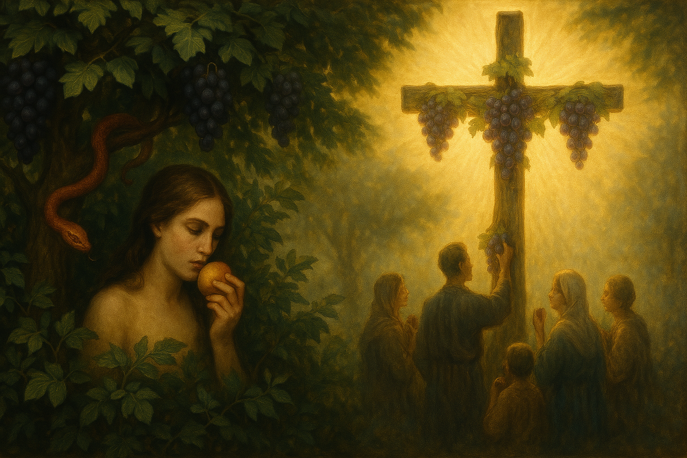
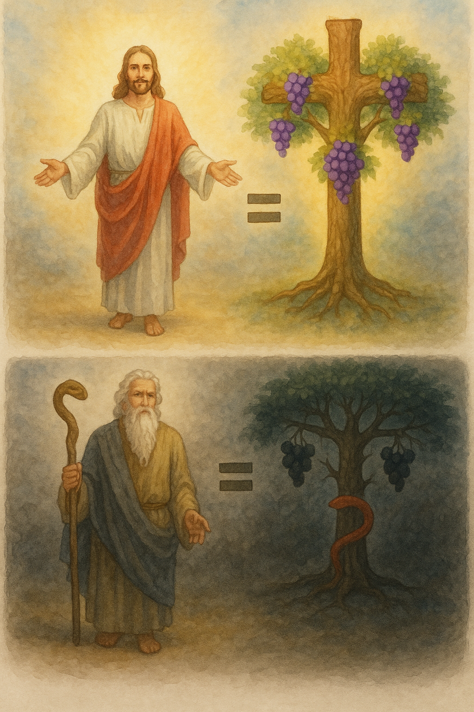
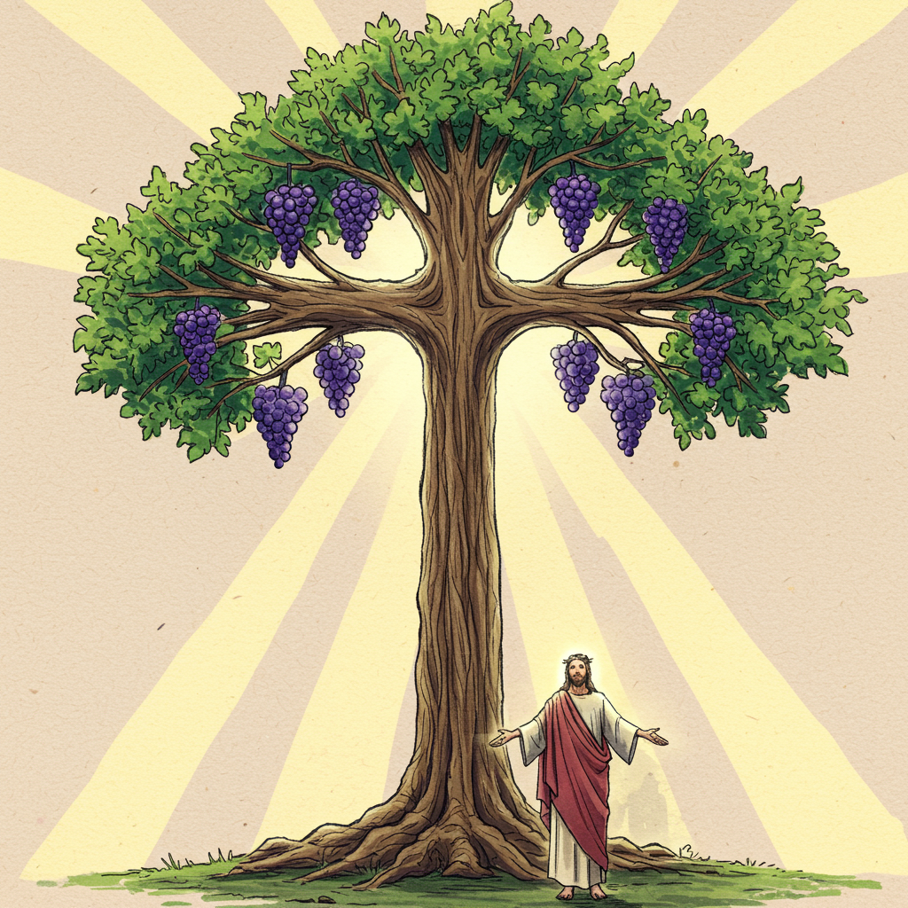
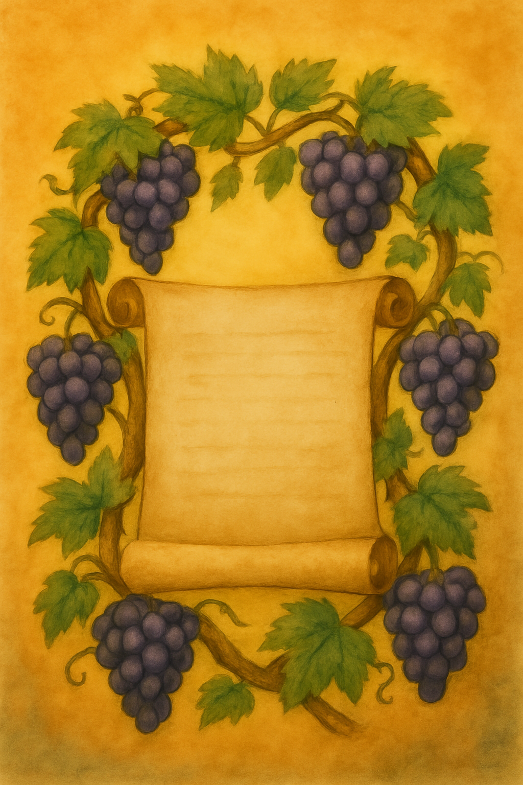

# THE LAW and the Tree of the Knowledge of Good and Evil

The article that follows is a **magnificent revelation**. It is not commonly known. It will increase your understanding of what the **New Covenant** has saved us from, and how **deadly** the **Old Covenant** can be to those who take it up without qualification.

This article presents a concept without embellishment, offering a revelation that's often overlooked. It rigorously compares scriptures, and is not merely an exposition.

While comparisons between the Law of Moses and the Tree of the Knowledge of Good and Evil have been made before, this review shows that they can be considered the same thing.

## The Food / Doctrine Principle

The scriptures are expressed heavily in parables. Events that occurred in real life became parables in hindsight (Galatians 4:24). This means that events that we read of provide both literal and figurative meanings, with the figurative having more weight—we would say these are *"spiritual"* meanings.

In scripture, however, **FOOD = DOCTRINE** in symbolism.

This will be important in considering the tree that Adam and Eve ate from.

### Food = Doctrine Examples

> Matthew 16:11-12 - How is it that ye do not understand that I spake it not to you concerning bread, that ye should beware of the leaven of the Pharisees and of the Sadducees? Then understood they how that **he bade them not beware of the leaven of bread, but of the doctrine of the Pharisees and of the Sadducees**.

In a deeper thread, but consistent with symbolism:

**JESUS = THE WORD** (John 1:14)  
**JESUS = BREAD / WINE** (John 6:54-58)

The **WORD** is **FOOD** to be **LEARNED**, as *doctrine* is *food* and *eating* becomes *learning*.

## Judging Similitudes: Tree of Life (Jesus) & Tree of Knowledge of Good and Evil (The Law)

A crucial principle of comparison we'll employ in this study is based on the weight and authority of chief elements. We hold that there cannot be multiple, distinct versions of the same core element. Instead, elements of lesser authority or weight serve as representations of the chief elements, meaning they are fundamentally the same concept expressed in different forms.

## The Two Trees

So here are the core symbolisms first.

### JESUS = THE LIFE

> John 14:6 - Jesus saith unto him, I am the way, the truth, and **the life**: no man cometh unto the Father, but by me.

There is an important principle where the reality outweighs the symbol, and the symbol points to the reality.

It can be seen here:

> John 6:32-33 - Then Jesus said unto them, Verily, verily, I say unto you, **Moses gave you not that bread from heaven**; but my Father giveth you **the true bread from heaven. For the bread of God is he which cometh down from heaven, and giveth life unto the world.**

So the spiritual reality is observed greater than the physical occurrence / symbol.

Of special note is the association of manna with the Law of Moses and Angel's Food (food = doctrine):

> Psalm 78:25 - Man did eat angels' food: he sent them meat to the full.

Compare:

> Deuteronomy 8:3 - And he humbled thee, and suffered thee to hunger, and fed thee with **manna**, which thou knewest not, neither did thy fathers know; that he might make thee know that **man doth not live by bread only, but by every word that proceedeth out of the mouth of the LORD doth man live.**

And so we see a repetition: The **manna**'s symbolism represents **the Word**, and the Word is the reality of the symbol, to be taken as having higher authority and literalism. In this case, we see Moses compares manna to the Word, and later the Word is Jesus. Therefore **manna = Jesus**. But the manna was not the literal life-giving food, as it is plainly stated later that those who ate of the manna died (John 6:49-51). So there was no life-giving quality to the actual symbolic physical element, but rather the reality of the life-giving power was in the Word itself.

With this strong principle applied, **The Tree of Life** must represent Jesus the same as the Manna did. This is because Jesus equated himself with **Life**. Therefore there **cannot be two separate entities which are a source of life**, but rather just one entity, with the lesser symbol pointing to the greater.

### The Tree of the Knowledge of Good and Evil

It is easy to identify Jesus as the tree of life, as he's also likened himself to a vine with branches. In light of the few proofs shown, we can confidently say that Jesus is the Tree of Life. (This does not negate the reality that Adam and Eve were exposed to and ate from literal trees, any more than Jesus negates the manna that fed the people.)

**If Jesus is the Tree of Life, then what is the Tree of the Knowledge of Good and Evil?**

Simple thinking would lead us to say that "it must be the opposite of Jesus! It must be Satan!" or something similar. However, we know that the Original Serpent was associated with the Tree of the Knowledge of Good and Evil, deceiving Eve to eat from it.

We will see many proofs harmonizing **the Law** with **the Tree**.

#### Moses Connects the Tree with the Law

Here Moses speaks of the Law:

> Deuteronomy 30:15 - See, I have set before thee this day life and **good**, and death and **evil**;

So apart from the tree, the OTHER entity containing **the knowledge of evil** is **The Law**. Based on the much further evidence to come, we can unite these two concepts to say this:

Just as the Tree of Life represented Jesus, the Tree of the Knowledge of Good and Evil represents the law.

### Scripture Comparisons Uniting the Law with the Tree of the Knowledge of Good and Evil

#### Became Gods

This is the first and most binding proof that the Tree and the Law are the same:

> John 10:35 - If he called them gods, unto whom the word of God came, and the scripture cannot be broken;

Jesus here refers to the Written Law (**Scripture**)

Compare to:

> Genesis 3:5,22, - [5] For God doth know that in the day ye eat thereof, then your eyes shall be opened, and **ye shall be as gods**, knowing good and evil. [22] And the Lord God said, Behold, the **man is become as one of us**, to know good and evil: and now, lest he put forth his hand, and take also of the tree of life, and eat, and live for ever:

So do BOTH the TREE and THE LAW have the same power of turning man into gods? It is more logical to say that just one thing has this power: *The Law* (**Angel's Food**).

#### Eyes Opened, Knowing Sin

Speaking of the Pharisees (experts in the Law), Jesus states:

> John 9:41 - Jesus said unto them, If ye were blind, ye should have no sin: **but now ye say, We see; therefore your sin remaineth**.

Compare this to Adam and Eve eating from the Tree:

> Genesis 3:7 - **And the eyes of them both were opened, and they knew that they were naked;** and they sewed fig leaves together, and made themselves aprons.

So the Law convicts people of being sinners, the same as the tree.

This is where the logic starts to show: Did the TREE give them the knowledge that they were naked? Does any literal fruit cause knowledge to manifest in the person? This EATING / LEARNING behavior is more easily attributed to the Law (Food = Doctrine). So the knowledge Adam and Eve received came through learning, not eating.

#### Brings Death

Speaking of the Law, this rule is stated: Death comes by sin, and sin's power by the Law.

> 1 Corinthians 15:56 - The sting of death is sin; and the strength of sin is the law.

The same principle shown in Genesis in regard to the tree:

> Genesis 2:17 - But of the tree of the knowledge of good and evil, thou shalt not eat of it: for in the day that thou eatest thereof thou shalt surely die.

If the strength of sin (sin bringing death) is the Law, then what was bringing death to Adam and Eve? The Law. The prior comparisons give credence to this.

#### Good, but Accuses Sinners

The law is known to be Good, but also accuses sinners.

> Genesis 3:6 - When the woman saw that the tree was **good for food** and pleasing to the eyes, and that it was **desirable for obtaining wisdom**, she took the fruit and ate it.

Compare to:

> Romans 7:7-25  
> [7] What shall we say then? Is the law sin? God forbid. Nay, **I had not known sin, but by the law**: for I had not known lust, except the law had said, Thou shalt not covet.  
> [8] But sin, taking occasion by the commandment, wrought in me all manner of concupiscence. **For without the law sin was dead**.  
> [9] For **I was alive without the law once: but when the commandment came, sin revived, and I died.**  
> [10] And the commandment, which was ordained to life, I found to be unto death.  
> [11] For sin, taking occasion by the commandment, **deceived me**, and by it slew me.  
> [12] Wherefore the law is holy, and the commandment holy, and just, and **good**.  
> [13] Was then that which is good made death unto me? God forbid. But sin, that it might appear sin, working death in me by that which is good; that sin by the commandment might become exceeding sinful.  
> [14] For we know that the law is spiritual: but I am carnal, sold under sin.  
> [15] For that which I do I allow not: for what I would, that do I not; but what I hate, that do I.  
> [16] If then I do that which I would not, I consent unto the law that it is good.  
> [17] Now then it is no more I that do it, but sin that dwelleth in me.  
> [18] For I know that in me (that is, in my flesh,) dwelleth no good thing: for to will is present with me; but how to perform that which is good I find not.  
> [19] For the good that I would I do not: but the evil which I would not, that I do.  
> [20] Now if I do that I would not, it is no more I that do it, but sin that dwelleth in me.  
> [21] **I find then a law, that, when I would do good, evil is present with me**.  
> [22] For I delight in the law of God after the inward man:  
> [23] But I see another law in my members, warring against the law of my mind, and bringing me into captivity to the law of sin which is in my members.  
> [24] **O wretched man that I am! who shall deliver me from the body of this death?  
> [25] I thank God through Jesus Christ our Lord. So then with the mind I myself serve the law of God; but with the flesh the law of sin.**

Reading the bold letters in this passage, the narrative is the same as the effects and differences of the two trees: The Tree of the Knowledge of Good and Evil and the Tree of Life.

Not only do we see spelled out in detail those things which are identified in the Tree of Knowledge of Good and Evil, but also the need for the Tree of Life. The Tree of Life saves from that first tree, and Jesus saves from the Law.

### Further Secondary Proof

#### Taught Cain and Abel How to Sacrifice

Many astute readers wonder why, in Genesis, Cain and Abel were sacrificing for their sins, since between the "original sin" and their time, the account makes no mention of God giving them a directive to sacrifice.

We find our answer in what we found above: The Tree of the Knowledge of Good and Evil taught them how to sacrifice, the same as the Law of Moses.

#### One Who Accuses You 

> John 5:45 - Do not think that I will accuse you to the Father: there is one that accuseth you, even Moses, in whom ye trust.

Yet we know the accuser to be Satan. So does Moses or Satan accuse? Remember that Moses' staff became a serpent, and he put up the bronze serpent which later became an idol (2 Kings 18:4). The accuser is in the law. Moses has a few associations with serpent symbolism. (Remember too Jude 1:9 in light of John 5:45 and the False Prophet in the Book of Revelation)

#### Law Given by Angels

The Law was given by angels, and predated Moses.

> Jubilees 1:28,29 [28] The Lord will appear in the sight of all, and all will know that I am the God of Israel, the father of all Jacob's children, and the king on Mt. Zion for the ages of eternity. Then Zion and Jerusalem will become holy.” [29] **The angel of the presence**, who was going along in front of the Israelite camp, took the tablets which told of the divisions of the years **from the time the law and the testimony were created** — for the weeks of their jubilees, year by year in their full number, and their jubilees from the time of the creation until the time of the new creation when the heavens, the earth, and all their creatures will be renewed like the powers of the sky and like all the creatures of the earth, until the time when the temple of the Lord will be created in Jerusalem on Mt. Zion. All the luminaries will be renewed for the purposes of healing, health, and blessing for all the elect ones of Israel and so that it may remain this way from that time throughout all the days of the earth.

Galatians states that the law was given by angels:

> Galatians 3:19 - Wherefore then serveth the law? It was added because of transgressions, till the seed should come to whom the promise was made; and **it was ordained by angels** in the hand of a mediator.

Knowing this, the Law had to be revealed by means of an angel (Satan), who deceived Eve.

The Book of Enoch (not accepted by all) explains that all sins were revealed by the fallen angels. A certain fallen angel brought Eve to eat of the fruit (the physical / literal side of the occurrence).

#### Pharisees: "Sons of Serpents"

The symbol of the serpent being associated with the tree is shown with the Pharisees' association with the Law, and their being compared to serpents:

> Matthew 23:33 - Ye serpents, ye generation of vipers, how can ye escape the damnation of hell?

It was the Pharisees who tried to bait the early Christians (partakers of the Tree of Life) to associate with the Law (the Tree of the Knowledge of Good and Evil).

> Acts 15:5 -  But there rose up certain of the sect of the Pharisees which believed, saying, That it was needful to circumcise them, and to **command them to keep the law of Moses**.

Here our serpents are baiting gentile Christians to adhere to the Law.

Notice the response:

> Acts 15:10,11 - Now therefore why **tempt ye God**, to put a yoke upon the neck of the disciples, which neither our fathers nor we were able to bear? But we believe that through the grace of the Lord Jesus Christ we shall be saved, even as they.

So we have the **serpents** doing the **tempting**, the same as in the Garden.

## The Evil Practice of Judaizing

Now that we see that the Law of Moses is what we were saved from, having the same force of death inflicted by Adam's sin, and they being the same (the Law and the Tree) we can now understand why the scriptures speak so much against Judaizing (the entire book of Galatians is about this).

Remember concerning the Law:

> 1 Timothy 1:8-10 - But we know that the law is good, if a man use it lawfully; Knowing this, that **the law is not made for a righteous man, but for the lawless and disobedient,** for the ungodly and for sinners, for unholy and profane, for murderers of fathers and murderers of mothers, for manslayers, For whoremongers, for them that defile themselves with mankind, for menstealers, for liars, for perjured persons, and if there be any other thing that is contrary to sound doctrine;

Knowing the arguments often given, I can easily hear someone debate this: "It says the Law is good if a man use it lawfully". The Man who uses the Law lawfully is Jesus (a Man). Nobody else can fulfill it.

It is also without understanding that people promote the Law of Moses within the Christian flock: 

> 1 Timothy 1:5-7 - 5 Now the end of the commandment is charity out of a pure heart, and of a good conscience, and of faith unfeigned: From which some having swerved have turned aside unto vain jangling; Desiring to be teachers of the law; **understanding neither what they say, nor whereof they affirm**.

## The Conclusion - Only God Can Eat From The Tree of the Knowledge of Good and Evil

Knowing the harmony of the symbols, we can see how only Jesus could fulfill the law. This Tree, set apart from Adam and Eve, typically symbolizes to most as being a tree that belonged to God only, being the actual knowledge of good and evil.

We know that Jesus (God) could fulfill the law (eat from it, and still live). But everyone else is slain by it.

#### Never Allow Judaizers to Deceive You

"You shall not SURELY die..." was the lie the serpent made. Yes, they became Gods. No, they had no chance of living forever having sinned.

Judaizers use a lot of tricks of argument and word plays to deceive Christians into taking up the law of Moses, observing its various holidays and practices (there are many sects like this, so they vary in what they teach).

This article was very clear in isolating the Law as that very thing which convicted Adam and Eve of sin, bringing their death. It also excluded them from the Tree of Life.

#### The Law and the Christian way are mutually exclusive as well:

> Galatians 5:4 - Christ is become of no effect unto you, whosoever of you are justified by the law; ye are fallen from grace.

It is a deadly thing to promote the practice of the Jewish law to Christians, and deceiving people into this is one of the greater sins you can make in this world, as the serpent himself and the Pharisees were associated with such a practice.

Original article here https://github.com/LeoBlanchette/articles/tree/main/the_law_and_the_tree 

## BONUS 

You may have notice that grapes were on both trees in the illustrations (AI Generated). But grapes grow on vines! 

The book of Enoch as well as a few other extra-biblical books reveal that **the original fruit was grape-like**, though being a tree. Likewise, Jesus blood is associated with the grape. 

> Enoch [32:3] And I came to the Garden of Righteousness, and from afar off trees more numerous than these trees and great--two trees there, very great, beautiful, and glorious, and magnificent, and the tree of knowledge, whose holy fruit they eat and know great wisdom. [32:4] That tree is in height like the fir, and its leaves are like (those of) the Carob tree: **and its fruit is like the clusters of the vine**, very beautiful: and the fragrance of the tree penetrates afar. [32:5] Then I said: 'How beautiful is the tree, and how attractive is its look!' [32:6] Then Raphael the holy angel, who was with me, answered me and said: **'This is the tree of wisdom, of which thy father old (in years) and thy aged mother, who were before thee, have eaten, and they learnt wisdom and their eyes were opened, and they knew that they were naked and they were driven out of the garden.'**

https://github.com/scrollmapper/bible_databases_deuterocanonical/blob/master/sources/en/1-enoch/1-enoch.md 

#### Share on Twitter

`#NewCovenant #JesusChrist brings #Salvation from the #OldCovenant #LawOfMoses. A #BiblicalRevelation on the #TreeOfKnowledge, it's vital #Theology for #ChristianFreedom. #BibleStudy reveals #GraceVsLaw, exposing #Judaizing.`