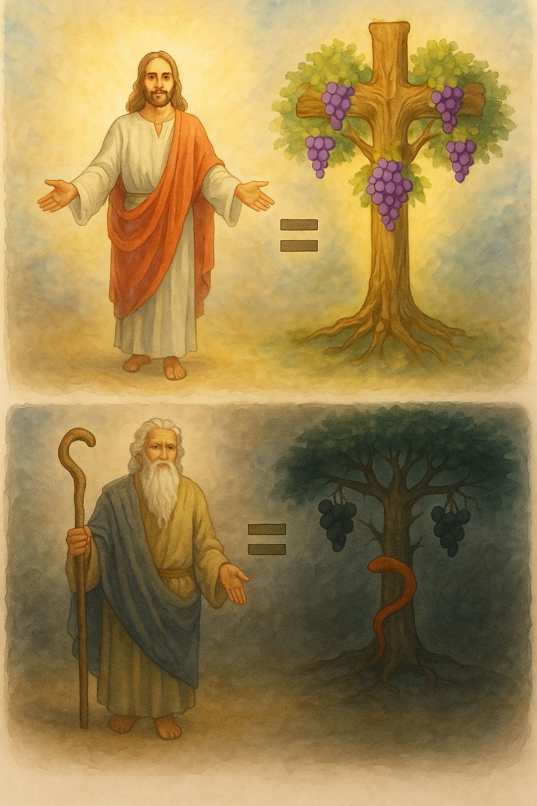

# THE LAW and the Tree of the Knowledge of Good and Evil 

The article that follows is a **magnicient revelation**. It is not commonly known. It will increase your understanding of what the **New Covenant** has saved us from, and how **deadly** the **Old Covenant** can be to those who take it up without qualification. 

This article presents a concept without embellishment, offering a revelation that's often overlooked. It rigorously compares scriptures, and is not merely an exposition. 

While comparisons between the Law of Moses and the Tree of the Knowledge of Good and Evil have been made before, this review shows that they can be considered the same thing. 

## The Food / Doctrine Principle 

The scriptures are expressed heavily in parables. Events that occurred in real life became parables in hindsight (Galatians 4:24). This means that events that we read of provide both literal and figurative meanings, with the figurative having more weight -- we would say these are *"spiritual"* meanings. 

In scripture, however, **FOOD = DOCTRINE** in symbolism. 

This will be important in considering the tree that Adam and Eve ate from. 

### Food = Doctrine Examples 

> Matthew 16:11-12 - How is it that ye do not understand that I spake it not to you concerning bread, that ye should beware of the leaven of the Pharisees and of the Sadducees? Then understood they how that **he bade them not beware of the leaven of bread, but of the doctrine of the Pharisees and of the Sadducees**.

In a deeper thread, but consistent with symbolism:

**JESUS = THE WORD** (John 1:14)
**JESUS = BREAD / WINE** (John 6:54-58)

The **WORD** is **FOOD** to be **LEARNED**, as *doctrine* is *food* and *eating* becomes *learning*. 

## Judging Similitudes: Tree of Life (Jesus) & Tree of Knowledge of Good and Evil (The Law)

A crucial principle of comparison we'll employ in this study is based on the weight and authority of chief elements. We hold that there cannot be multiple, distinct versions of the same core element. Instead, elements of lesser authority or weight serve as representations of the chief elements, meaning they are fundamentally the same concept expressed in different forms.

So here are the core symbolisms first. 

